# Lab 01 — Mux & Demux

本 Lab 從基本 **Logic Gate** 出發，進一步建立 Mux / Demux combinational circuit，並開始使用 Verilog 描述、組合與驗證 Digital Logic。

> **Logic Gate → Mux / Demux → Verilog → Hierarchical Design → Testbench → Simulation**

---

## Topics

| Category | Topics |
|---|---|
| Logic | Logic Gate、Functional Completeness、Universal Gate |
| Circuit | Multiplexer、Demultiplexer、Gate-Level Circuit |
| Design | Hierarchical Design、Area / Speed Comparison、Critical Path、Logical Effort |
| Verilog | Gate Level、Behavioral Level、Vector、Wire、Continuous Assignment、Module Instantiation |
| Verification | Testbench、Simulation、Waveform Verification |

---

## Logic Gate & Universal Gate

課程首先從基本 Logic Gate 的控制行為開始：

- **AND**：Block / Clear 或 Pass
- **OR**：Keep 或 Set
- **XOR**：Keep 或 Toggle

接著利用 **Functional Completeness** 的概念，練習只使用 NAND 或 NOR 建構其他基本 Logic Gates，理解 NAND 與 NOR 作為 Universal Gate 的特性。

<details>
<summary><b>Universal Gate Implementations</b></summary>

<br>

### NAND

<table>
<tr>
<td align="center">
<b>OR by NAND</b><br><br>
<a href="./images/q2_nand_or.png">
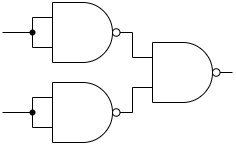
</a>
</td>

<td align="center">
<b>XOR by NAND</b><br><br>
<a href="./images/q2_nand_xor.png">
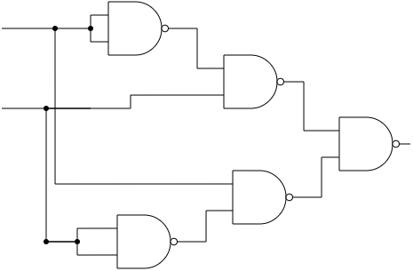
</a>
</td>
</tr>
</table>

### NOR

<table>
<tr>
<td align="center">
<b>NOT by NOR</b><br><br>
<a href="./images/q2_nor_not.png">
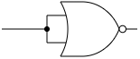
</a>
</td>

<td align="center">
<b>OR by NOR</b><br><br>
<a href="./images/q2_nor_or.png">
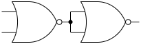
</a>
</td>
</tr>

<tr>
<td align="center" colspan="2">
<b>AND by NOR</b><br><br>
<a href="./images/q2_nor_and.png">
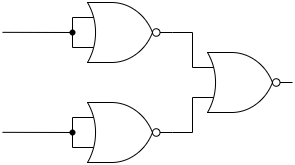
</a>
</td>
</tr>
</table>

</details>

---

## Mux & Demux

本 Lab 的主要 combinational system 為：

```text
src
 │
 ▼
Mux
 │
 ▼
channel
 │
 ▼
Demux
 │
 ▼
dst
```

**Mux** 根據 `src_sel`，從多個 source 中選出一個訊號送入 `channel`。

**Demux** 則根據 `dst_sel`，將 `channel` 導向指定的 destination。

---

## Lecture Examples

課堂中以簡單的 Mux circuit 逐步介紹不同的 Verilog 描述方式，以及如何利用 module instantiation 建立 hierarchical design。

| File | Concept |
|---|---|
| [`GL_Mux_2to1.v`](./example/GL_Mux_2to1.v) | Gate Level、built-in gate primitives |
| [`BL_Mux_2to1.v`](./example/BL_Mux_2to1.v) | Continuous Assignment、ternary operator |
| [`BL_Mux_4to1.v`](./example/BL_Mux_4to1.v) | Vector、Behavioral Level |
| [`CB_Mux_4to1.v`](./example/CB_Mux_4to1.v) | Module Instantiation、Hierarchical Design |

這些較小的 examples 用來建立後續 Practice 所需要的 Verilog 基礎。

---

## Architecture Comparison

課程中分別使用兩種 architecture 實作 **4:1 Mux** 與 **1:4 Demux**，並比較不同 circuit structure 的 Area 與 Speed。

> 點擊圖片可查看完整尺寸。

### 4:1 Mux

#### v1 — Direct Gate-Level Implementation

直接利用 `src_sel[1:0]` 與其反相信號產生 selection conditions，再透過 AND / OR gates 選出對應的 source。

#### v2 — Hierarchical Implementation

將 4:1 Mux 拆成多個 2:1 Mux，以兩層 selection structure 完成資料選擇。

<table>
<tr>
<td align="center">
<b>Mux v1</b><br><br>
<a href="./images/q3_mux_v1.png">
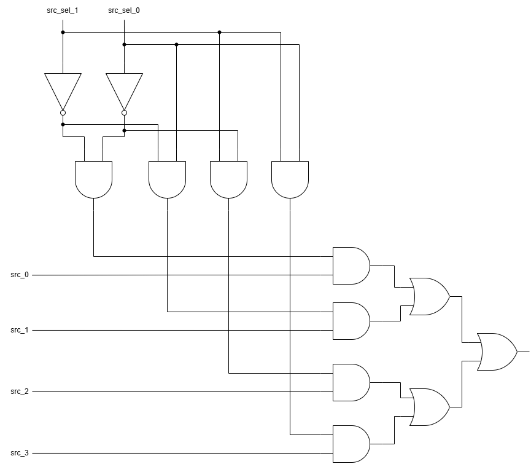
</a>
</td>

<td align="center">
<b>Mux v2</b><br><br>
<a href="./images/q3_mux_v2.png">
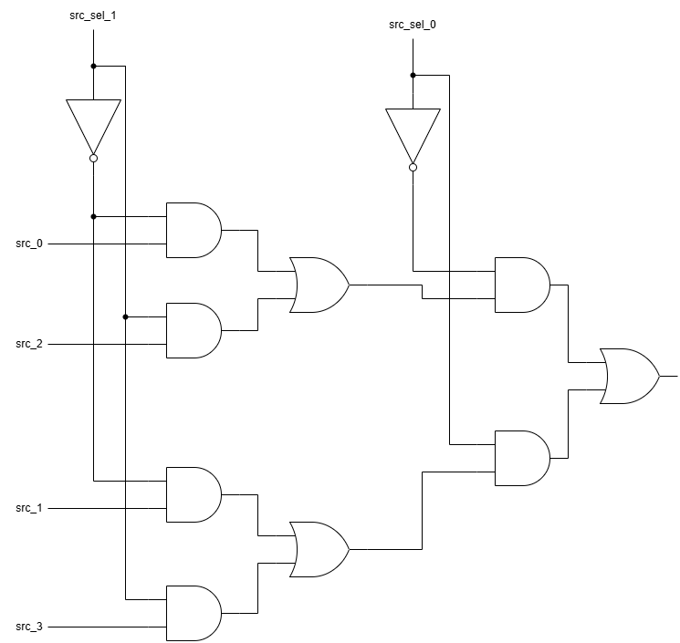
</a>
</td>
</tr>
</table>

| Design | Area (transistors) | Estimated Delay (τ) |
|---|---:|---:|
| Mux v1 | 70 | ≈ 28.64 |
| Mux v2 | 58 | ≈ 28.64 |

在此分析條件下，兩種 architecture 的 estimated delay 相同，但 **v2 使用較少的 hardware area**。

---

### 1:4 Demux

#### v1 — Direct Gate-Level Implementation

利用 `dst_sel[1:0]` 與其反相信號產生 selection conditions，再將 `channel` 導向對應的 destination。

#### v2 — Hierarchical Implementation

將 1:4 Demux 拆成多個 1:2 Demux，以兩層 routing structure 將 `channel` 導向指定 destination。

<table>
<tr>
<td align="center">
<b>Demux v1</b><br><br>
<a href="./images/q3_demux_v1.png">
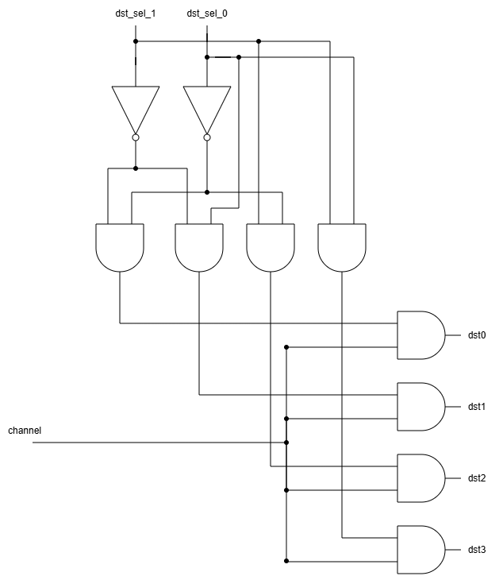
</a>
</td>

<td align="center">
<b>Demux v2</b><br><br>
<a href="./images/q3_demux_v2.png">
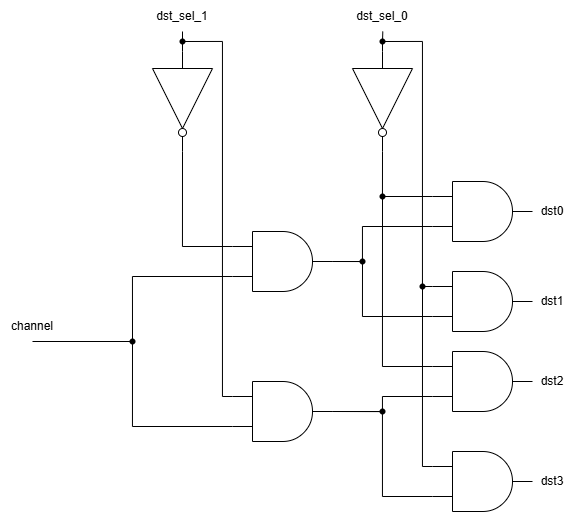
</a>
</td>
</tr>
</table>

| Design | Area (transistors) | Estimated Delay (τ) |
|---|---:|---:|
| Demux v1 | 52 | ≈ 18.03 |
| Demux v2 | 40 | ≈ 17.07 |

在此分析條件下，**v2 同時具有較小的 hardware area 與 estimated delay**。

> Area 以 transistor count 估算；Delay 依 Lab Appendix 的 Critical Path / Logical Effort method 計算，並設定 `H = 4`。此結果為 analytical estimation，而非 Vivado synthesis timing report。

---

## Practice

> Practice 1 與 Practice 2 使用 Tinkercad 完成，本 repository 主要保存後續 Verilog 實作，因此不另外保存 Tinkercad projects。

### Practice 3 — 4:1 Mux + 1:4 Demux

[查看 Practice 3 Source Code](./practice3)

使用 Verilog 建立完整的 4-source / 4-destination routing system：

```text
src[3:0]
    │
    ▼
GL_Mux_4to1
    │
  channel
    │
    ▼
CB_Demux_1to4
    │
    ▼
dst[3:0]
```

其中：

- `GL_Mux_4to1` 使用 Gate Level 描述
- `Demux_1to2` 作為基本 Demux module
- `CB_Demux_1to4` 透過三個 `Demux_1to2` 建立 hierarchical structure
- `top_4` 整合 Mux 與 Demux
- Testbench 分別驗證 individual modules 與完整 system

#### Simulation

<a href="./images/practice3_waveform.png">
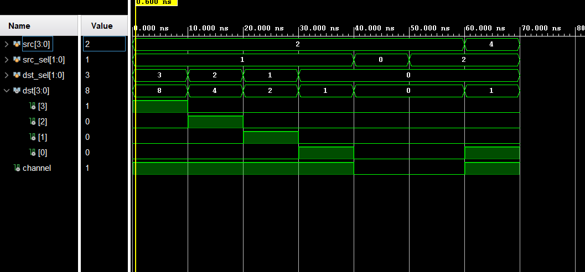
</a>

透過 waveform 驗證不同 `src_sel`、`dst_sel` 與 source value 下的 selection 與 routing behavior。

---

### Practice 4 — 8:1 Mux + 1:8 Demux

[查看 Practice 4 Source Code](./practice4)

將 Practice 3 的 system 擴充為 8-source / 8-destination：

```text
src[7:0]
    │
    ▼
BL_Mux_8to1
    │
  channel
    │
    ▼
BL_Demux_1to8
    │
    ▼
dst[7:0]
```

Mux 與 Demux 皆以 **Behavior Level** 實作，並由 `top_8` 完成整體 module integration。

#### Simulation

<a href="./images/practice4_waveform.png">
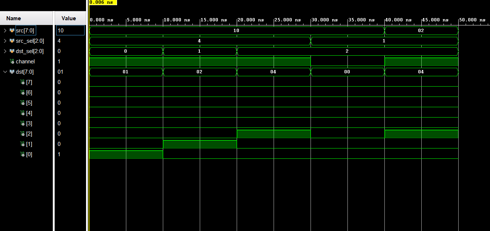
</a>

透過 `tb_top_8.v` 驗證 source selection、destination routing 與完整 system behavior。

---

## Additional Project — Programmable Bit Router

[查看 Programmable Bit Router](./project)

完成原本 Lab 內容後，另外設計一個小型 Project，將 Mux / Demux 與額外 control logic 組合成可程式化的 bit routing system。

```text
src[7:0]
   │
   ▼
Mux_8to1
   │
selected_bit
   │
   ▼
Bit_Controller
   │
channel
   │
   ▼
Demux_1to8
   │
   ▼
dst[7:0]
```

除了 `src_sel` 與 `dst_sel` 外，系統另外加入：

- `enable`：控制是否允許訊號輸出
- `invert`：控制 selected bit 是否反相

主要 modules：

```text
Mux_8to1
Bit_Controller
Demux_1to8
top_router
```

此 Project 用來練習從新的 Specification 自行完成：

> **Module Decomposition → Interface Design → Verilog → Testbench → Waveform Verification**

### Simulation

<a href="./images/project_waveform.png">
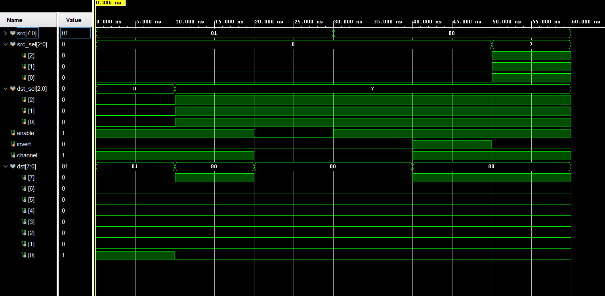
</a>

Testbench 驗證 source / destination selection、`enable`、`invert` 與 selected bit 為 0 / 1 時的 system behavior。

---

## Repository Structure

```text
lab01/
│
├── README.md
│
├── example/
│   ├── GL_Mux_2to1.v
│   ├── BL_Mux_2to1.v
│   ├── BL_Mux_4to1.v
│   └── CB_Mux_4to1.v
│
├── images/
│   ├── q2_nand_or.png
│   ├── q2_nand_xor.png
│   ├── q2_nor_and.png
│   ├── q2_nor_not.png
│   ├── q2_nor_or.png
│   ├── q3_mux_v1.png
│   ├── q3_mux_v2.png
│   ├── q3_demux_v1.png
│   ├── q3_demux_v2.png
│   ├── practice3_waveform.png
│   ├── practice4_waveform.png
│   └── project_waveform.png
│
├── practice3/
│   ├── GL_Mux_4to1.v
│   ├── Demux_1to2.v
│   ├── CB_Demux_1to4.v
│   ├── top_4.v
│   ├── tb_GL_Mux_4to1.v
│   ├── tb_CB_Demux_1to4.v
│   └── tb_top_4.v
│
├── practice4/
│   ├── BL_Mux_8to1.v
│   ├── BL_Demux_1to8.v
│   ├── top_8.v
│   └── tb_top_8.v
│
└── project/
    ├── README.md
    ├── Mux_8to1.v
    ├── Bit_Controller.v
    ├── Demux_1to8.v
    ├── top_router.v
    └── tb_top_router.v
```