# Lab 02 — Encoder & Decoder

Lab 02 延續 Lab 01 的 combinational logic design，進一步介紹 **Priority Encoder、7-Segment Decoder、Procedural Block 與 FPGA LUT implementation**。

本 Lab 從 Encoder / Decoder 的 Boolean logic 出發，逐步進入較高階的 Verilog behavioral description，並透過 simulation、hierarchical integration 與 synthesis schematic 觀察 RTL 如何映射至 FPGA resources。

> **Truth Table → Encoder / Decoder → Procedural Verilog → Testbench → Integration → Synthesis → LUT → Mini-Project**

---

## Topics

| Category | Topics |
|---|---|
| Logic | Encoder、Priority Encoder、Decoder、Don't Care、Boolean Simplification |
| Display | BCD、7-Segment Display、Active-Low Segment Control |
| Verilog | `always @(*)`、`reg` / `wire`、`if / else`、`case`、`for` loop、`localparam`、Reduction Operator |
| Design | Combinational Logic、Hierarchical Design、Module Integration、Latch Avoidance、Top-Level Glue Logic |
| Verification | Testbench、Exhaustive Test、Priority Verification、Waveform、Self-Checking Testbench |
| FPGA | XDC、Synthesis、Implementation、Bitstream、LUT、MUXF7 |

---

## Encoder & Decoder System

本 Lab 的主要 combinational system 可以整理為：

```text
Input Lines
    │
    ▼
Priority Encoder
    │
    ▼
 BCD / Code
    │
    ▼
7-Segment Decoder
    │
    ▼
7-Segment Display
```

### Priority Encoder

一般 Encoder 將 active input 轉換為對應的 binary code。

Priority Encoder 則進一步處理 **多個 input 同時 active** 的情況，只輸出 priority 最高的 input 編號。

例如：

```text
in[9] > in[8] > ... > in[1]
```

若：

```text
in[5] = 1
in[2] = 1
```

則輸出：

```text
BCD = 5
```

Truth table 中較低 priority 的 inputs 可以標示為 **don't care (`x`)**，因為它們已不再影響輸出。

---

### 7-Segment Decoder

Decoder 將 4-bit code 轉換成七個 segment 的 control signals：

```text
BCD[3:0]
    │
    ▼
 Decoder
    │
    ▼
out[6:0]
```

本 Lab 使用 **active-low segment encoding**：

```text
0 → segment ON
1 → segment OFF
```

除了 Decimal `0~9` 外，也建立 `A、b、c、d、E、F` pattern，使單一 7-Segment Display 可以顯示完整 hexadecimal `0~F`。

---

## Verilog Procedural Block

Lab 02 開始使用 Procedural Block 描述 combinational logic：

```verilog
always @(*) begin
    ...
end
```

### `wire` and `reg`

使用 continuous assignment：

```verilog
assign out = ...;
```

通常由 `wire` / net type 承接。

若 signal 在 `always` block 中被賦值：

```verilog
always @(*) begin
    out = ...;
end
```

則在傳統 Verilog 中需要宣告為 `reg`。

> `reg` 代表 signal 由 procedural block 賦值，不代表 synthesis 後一定會形成 register。

---

### `if / else`

Priority logic 很適合利用 `if / else if` 描述：

```verilog
if (in[9])
    BCD = 4'd9;
else if (in[8])
    BCD = 4'd8;
...
```

判斷順序本身即可描述 priority。

---

### `case`

Lookup / mapping 類型的 combinational logic 適合使用 `case`：

```verilog
case (BCD)
    4'd0: out = S7_0;
    4'd1: out = S7_1;
    ...
endcase
```

這與 Decoder 的 truth-table behavior 十分接近。

---

### Avoiding Unintended Latches

Combinational `always @(*)` 中，每一條可能的 execution path 都必須對 output 賦值。

可以透過：

```verilog
else
```

或：

```verilog
default
```

補齊所有輸入情況。

若某些 condition 沒有指定 output，hardware 可能需要保留 previous value，進而 infer unintended latch。

---

### `localparam`

七段顯示器的 bit patterns 使用 `localparam` 命名：

```verilog
localparam S7_0 = 7'b0000001;
localparam S7_1 = 7'b1001111;
...
```

相較於直接在 logic 中重複使用 binary constants，可提升 code readability。

---

## Lecture Examples

課堂範例以相同的 Decoder function 示範不同 Verilog description styles。

| File | Method |
|---|---|
| [`Decoder_v1.v`](./example/Decoder_v1.v) | Continuous Assignment + Ternary Operator |
| [`Decoder_v2.v`](./example/Decoder_v2.v) | Procedural Block + `if / else` |
| [`Decoder_v3.v`](./example/Decoder_v3.v) | Procedural Block + `case` + `localparam` |

三種寫法在 syntax 與 abstraction level 上不同，但都可以描述相同的 combinational function。

---

## Practice 1 — Priority Encoder + 7-Segment Display

Practice 1 使用 Tinkercad 建立 Priority Encoder、BCD Decoder 與 7-Segment Display circuit。

```text
Input
  │
  ▼
Priority Encoder
  │
 BCD
  │
  ▼
CD4511
  │
  ▼
7-Segment Display
```

此 repository 主要保存重新實作的 Verilog / Vivado 練習，因此不另外保存 Tinkercad project。

---

## Practice 2 — 7-Segment Decoder

[查看 Practice 2 Source Code](./practice2)

Practice 2 使用不同 Verilog description styles 建立兩種 Decoder。

### Decoder_7S1

[`Decoder_7S1.v`](./practice2/Decoder_7S1.v)

將 4-bit input `0000 ~ 1111` 轉換為 `0 ~ F` 的單一 7-Segment Display pattern。

Implementation 使用：

- `always @(*)`
- `case`
- `localparam`
- active-low segment pattern

Testbench 使用 `for` loop 掃過所有 16 種 4-bit input，進行 exhaustive verification。

#### Simulation

<table>
<tr>
<td align="center">
<a href="./images/p2_1_waveform_1.png">
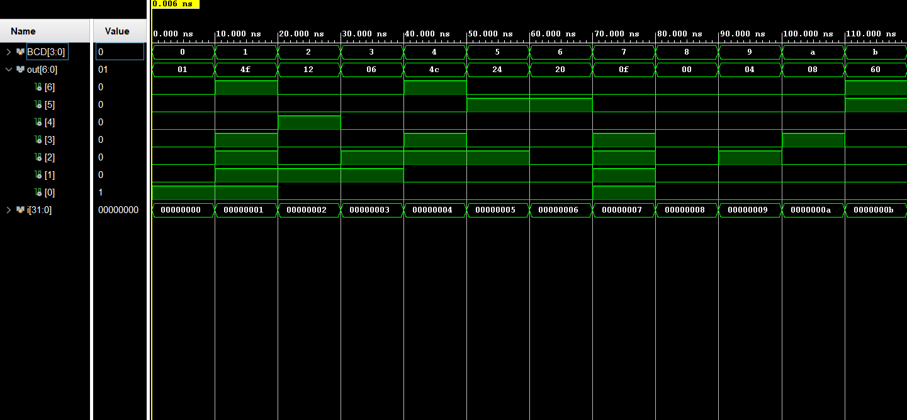
</a>
</td>
<td align="center">
<a href="./images/p2_1_waveform_2.png">
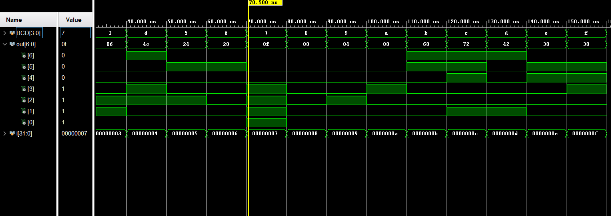
</a>
</td>
</tr>
</table>

---

### Decoder_7S2

[`Decoder_7S2.v`](./practice2/Decoder_7S2.v)

將 4-bit input `0~15` 顯示為兩位 decimal number：

```text
0  → 00
1  → 01
...
9  → 09
10 → 10
...
15 → 15
```

十位數使用 continuous assignment，個位數則使用 `always @(*) + if / else`。

#### Simulation

<table>
<tr>
<td align="center">
<a href="./images/p2_2_waveform_1.png">
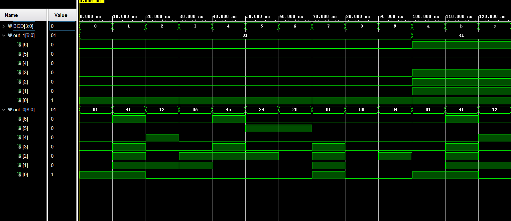
</a>
</td>
<td align="center">
<a href="./images/p2_2_waveform_2.png">
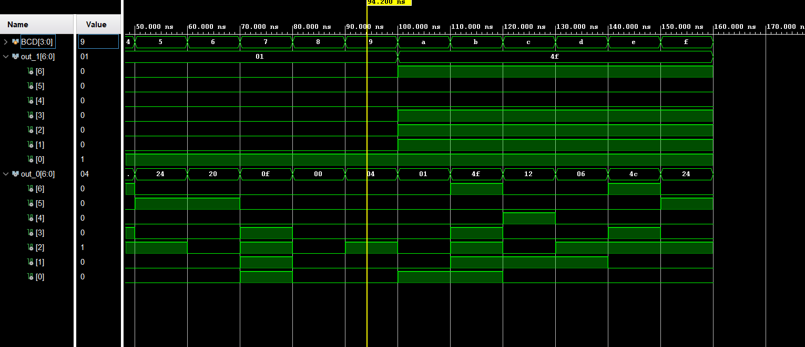
</a>
</td>
</tr>
</table>

Waveform 特別確認 `9 → 10` 的 decimal boundary，以及 `10~15` 的 tens / ones digit conversion。

---

## Practice 3 — Priority Encoder

[查看 Practice 3 Source Code](./practice3)

Practice 3 使用 `always @(*) + if / else if` 實作 Priority Encoder。

### Encoder_9

[`Encoder_9.v`](./practice3/Encoder_9.v)

```text
in[9:1]
   │
   ▼
Encoder_9
   │
   ▼
BCD[3:0]
```

Priority：

```text
in[9] > in[8] > ... > in[1]
```

Testbench 除了測試 zero input 與 single active input，也加入 multiple active inputs 驗證 priority behavior。

#### Simulation

<a href="./images/p3_1_waveform.png">
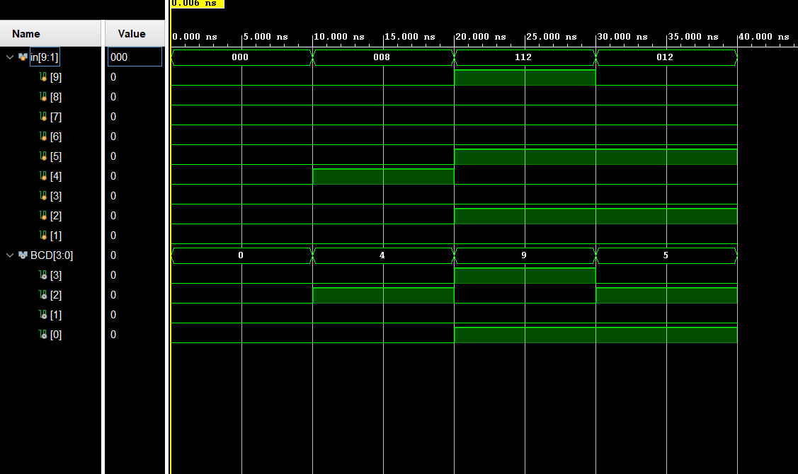
</a>

---

### Encoder_15

[`Encoder_15.v`](./practice3/Encoder_15.v)

將 Priority Encoder 擴充至 `in[15:1]`，並輸出 `BCD[3:0]`。

Priority：

```text
in[15] > in[14] > ... > in[1]
```

#### Simulation

<a href="./images/p3_2_waveform.png">
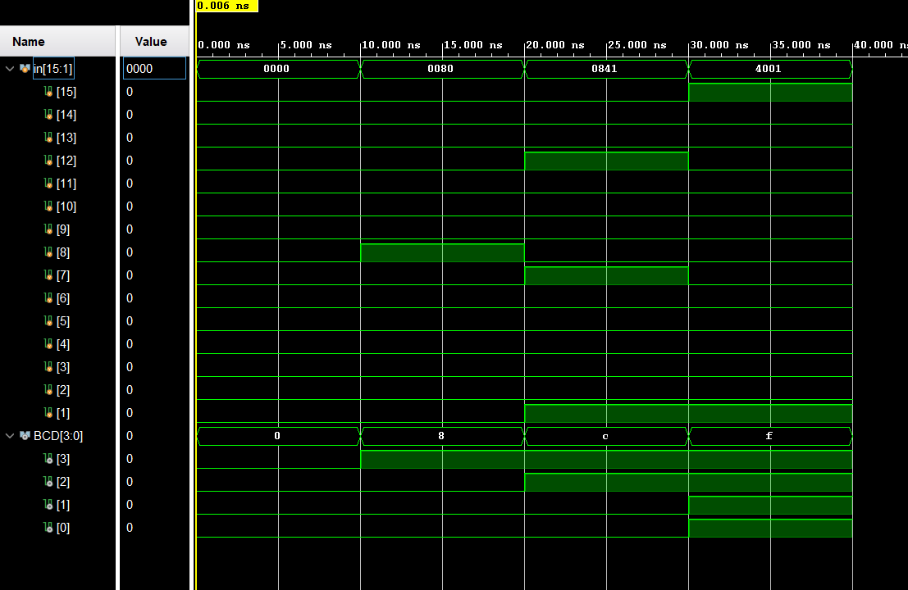
</a>

Waveform 驗證 zero input、single input，以及多個 input 同時 active 時的 priority selection。

---

## Practice 4 — Encoder + Decoder Integration

[查看 Practice 4 Source Code](./practice4)

Practice 4 將 `Encoder_15` 與 `Decoder_7S2` 整合成完整 hierarchical system：

```text
in[15:1]
    │
    ▼
Encoder_15
    │
 BCD[3:0]
    │
    ▼
Decoder_7S2
    │
    ├── out_1[6:0]
    └── out_0[6:0]
```

Top module：

[`top_15_2.v`](./practice4/top_15_2.v)

此 Practice 主要練習：

- Module Instantiation
- Hierarchical Design
- Internal Signal Connection
- `wire` / `reg` role
- Top-Level Integration
- Integration Verification

### Simulation

Encoder / BCD verification：

<a href="./images/p4_waveform_1.png">
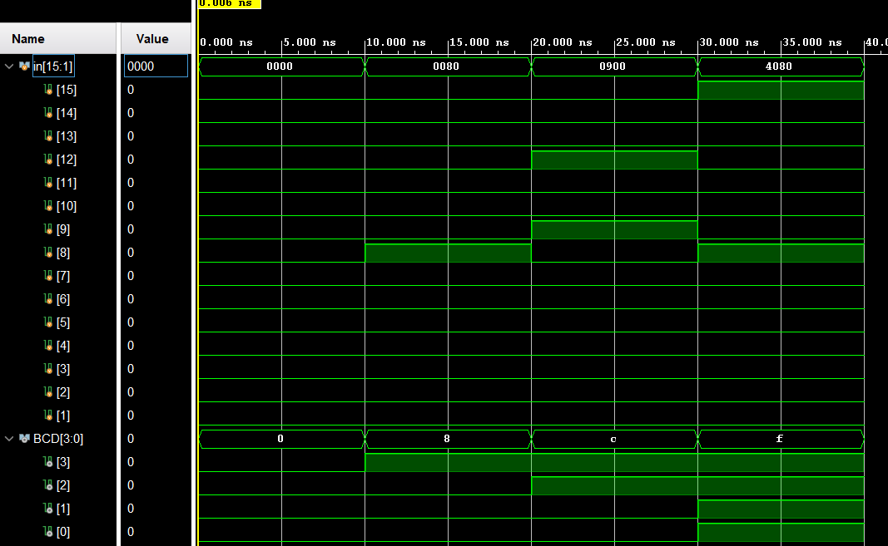
</a>

7-Segment output verification：

<a href="./images/p4_waveform_2.png">
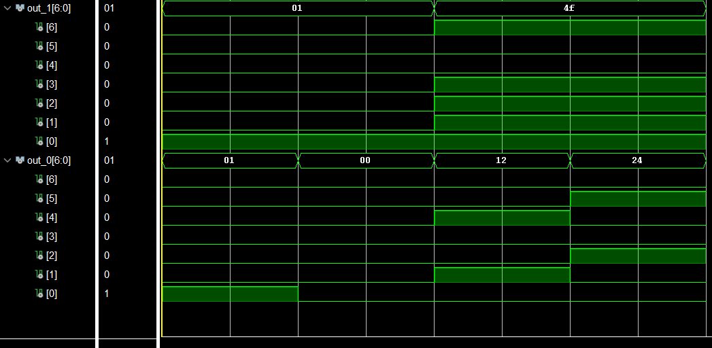
</a>

---

## Practice 5 — FPGA Implementation

Practice 5 沿用 Practice 4 的 RTL design，加入 PYNQ-Z2 FPGA pin constraints。

本資料夾保留：

[`PYNQ-Z2 v1.0.xdc`](./practice5/PYNQ-Z2%20v1.0.xdc)

RTL design 則直接參考 Practice 4，避免保存重複的 source files。

### FPGA Design Flow

```text
Verilog RTL
    │
    ▼
Pre-Simulation
    │
    ▼
Synthesis
    │
    ▼
Implementation
    │
    ▼
Generate Bitstream
    │
    ▼
Program FPGA
```

XDC file 負責建立：

```text
Top-Level Verilog Port
          ↕
Physical FPGA Pin
```

### Hardware Demo

[Watch the FPGA Hardware Demo on YouTube](https://www.youtube.com/shorts/6mBTegdp79w)

---

## FPGA LUT & Synthesis

FPGA combinational logic 主要使用 **LUT — Look-Up Table** 實現。

LUT 可以視為 programmable truth table，Vivado Synthesis 會將 RTL function 進行 Boolean optimization，並映射至 LUT / MUX resources。

### Synthesis Results

| Design | Synthesis Mapping | Interpretation |
|---|---|---|
| 1:4 Demux | `4 × LUT3` | 每個 `dst[x]` 為一個 3-input Boolean function |
| 8:1 Mux | `2 × LUT6 + MUXF7` | 兩個 4:1 Mux 後再由最高位 selector 選擇 |
| 1:8 Demux | `8 × LUT4` | 每個 `dst[x]` 為一個 4-input Boolean function |
| Decoder_7S1 | `7 × LUT4` | 每個 segment output 為一個 4-input Boolean function |
| Encoder_9 | Multi-Level LUT Network | 較複雜 output dependency 超過單一 LUT6 capacity |

<details>
<summary><b>View Synthesis Schematics</b></summary>

<br>

### 1:4 Demux

<a href="./images/q2_demux_1to4_schematic.png">
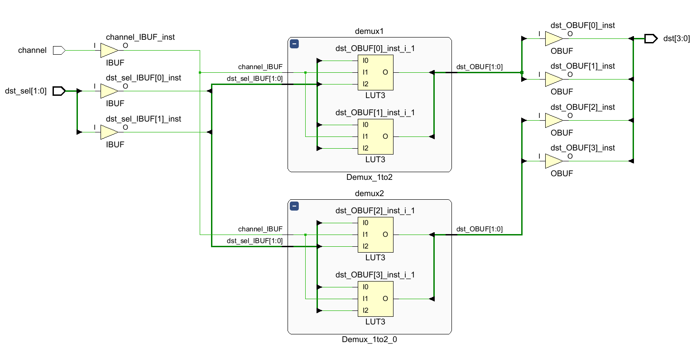
</a>

每個 output：

```text
dst[x] = f(channel, dst_sel[1:0])
```

只依賴三個 inputs，因此每個 output 可由一顆 LUT3 實現。

---

### 8:1 Mux

<a href="./images/q2_mux_8to1_schematic.png">
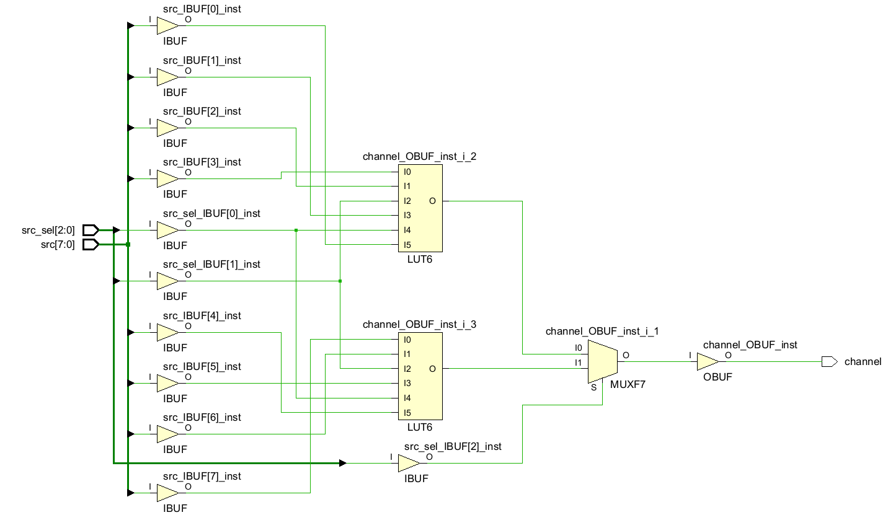
</a>

8:1 Mux 可拆成：

```text
4:1 Mux ──┐
          ├── MUXF7 ──> channel
4:1 Mux ──┘
```

每個 4:1 Mux 由一顆 LUT6 實現，最後使用 `src_sel[2]` 控制 MUXF7。

---

### 1:8 Demux

<a href="./images/q2_demux_1to8_schematic.png">
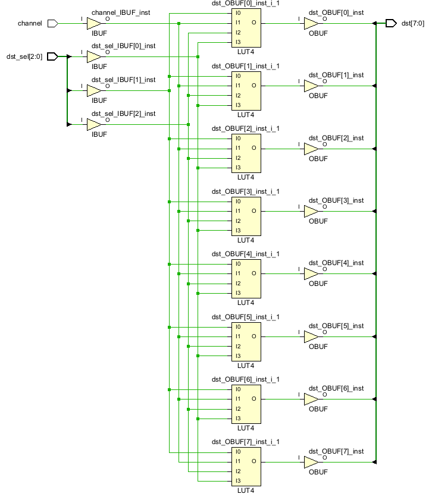
</a>

每個 output：

```text
dst[x] = f(channel, dst_sel[2:0])
```

共有四個 relevant inputs，因此使用一顆 LUT4，總共 `8 × LUT4`。

---

### Decoder_7S1

<a href="./images/q2_decoder_7S1_schematic.png">
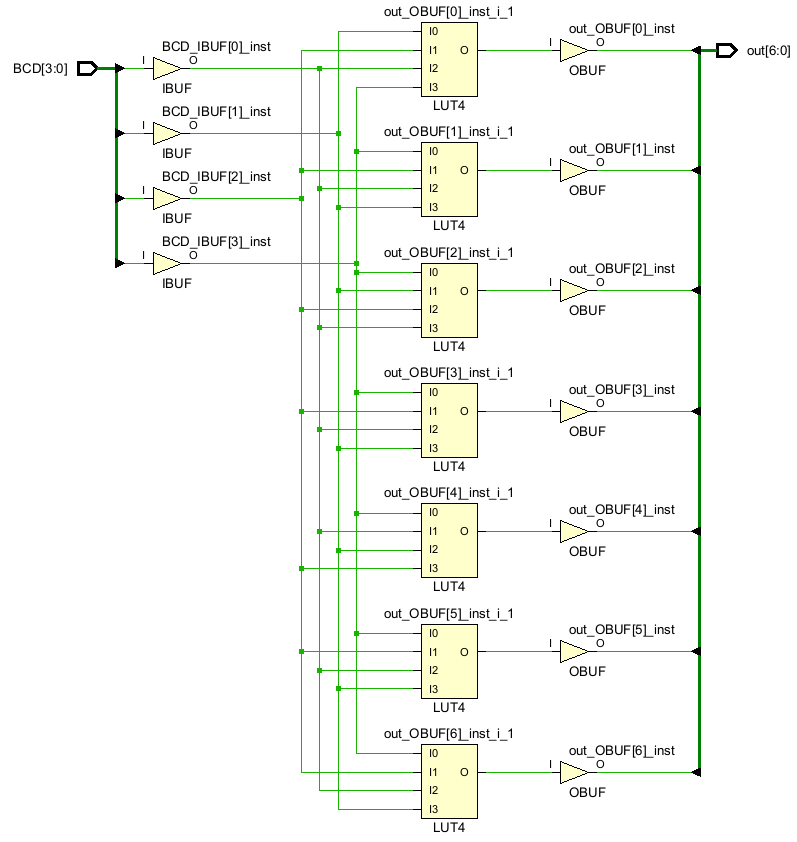
</a>

七個 segment outputs 分別為：

```text
out[0] = f0(BCD[3:0])
...
out[6] = f6(BCD[3:0])
```

每個 output 都是一個 4-input Boolean function，因此使用 `7 × LUT4`。

---

### Encoder_9

<a href="./images/q2_encoder_9_schematic.png">
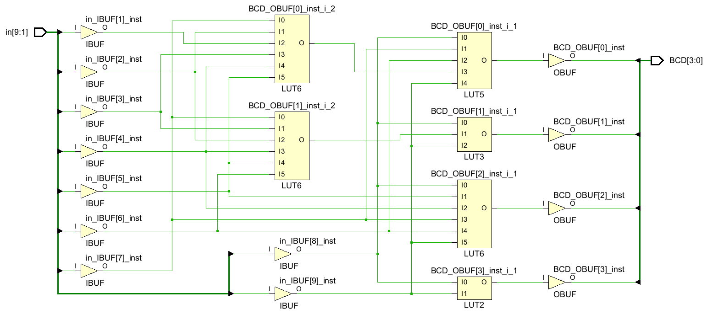
</a>

Encoder_9 的四個 BCD output 具有不同的 input dependency：

| Output | Dependency | Mapping |
|---|---:|---|
| `BCD[3]` | 2 inputs | LUT2 |
| `BCD[2]` | 6 inputs | LUT6 |
| `BCD[1]` | > 6 inputs | LUT6 + LUT3 |
| `BCD[0]` | > 6 inputs | LUT6 + LUT5 |

當 Boolean function 的 relevant inputs 超過單一 LUT6 能處理的數量時，Vivado 會將 function decomposition 成多層 LUT network。

</details>

---

## Additional Project — Dual-Mode Priority Keypad Display

[查看 Dual-Mode Priority Keypad Display](./project)

此 Mini-Project 將 Lab 02 的 Priority Encoder、7-Segment Decoder 與 hierarchical design 整合成一個較完整的 combinational system。

```text
key[15:0]
priority_mode
    │
    ▼
Priority_Encoder16
    │
    ├── raw_code
    └── raw_valid
            │
            ▼
       Top + enable
            │
       code + valid
            │
            ▼
        Decoder_7S
      + display_mode
            │
      ┌─────┴─────┐
      ▼           ▼
  seg_tens     seg_ones
```

Project 加入：

- 16-key Priority Encoder
- High-index / Low-index priority mode
- `enable` / `valid` system control
- HEX / Decimal display mode
- Two-digit 7-Segment output
- Reduction OR：`|key`
- Top-level glue logic
- Self-Checking Testbench

### Verification

此 Project 不使用大量 waveform 人工比對，而是由 Testbench 自動比較 actual output 與 expected output。

測試涵蓋：

```text
No active key
Enable disabled
key[0] / key[15]
Multiple active keys
High / Low priority
Single-key exhaustive test 0 ~ 15
HEX / Decimal mode
Decimal 9 → 10 boundary
Decimal upper boundary 15
```

Final XSim simulation 中所有 test cases 皆顯示 `passed`。

詳細設計與 verification 說明請見：

[`project/README.md`](./project/README.md)

---

## Key Observations

### RTL Description vs. FPGA Hardware

同一個 combinational function 可以使用：

```text
Boolean Expression
Continuous Assignment
if / else
case
```

等不同方式描述。

Synthesis tool 會將 RTL behavior 轉換並最佳化為 FPGA 上的 LUT / MUX network，因此 RTL code 的寫法不一定直接對應到固定的 gate structure。

### Valid Signal

Mini-Project 中：

```text
key[0] 被選中 → code = 0, valid = 1
沒有任何 key → code = 0, valid = 0
```

因此只看 `code` 無法區分「選到 key[0]」與「沒有有效輸入」，需要額外的 `valid` signal。

### Verification

較小的 Practice 適合直接閱讀 waveform；當 system complexity 增加後，可使用 **Self-Checking Testbench** 自動判斷 PASS / FAIL，將 waveform 保留作為 debug 與局部檢查工具。

---

## Repository Structure

```text
lab02/
│
├── README.md
│
├── example/
│   ├── Decoder_v1.v
│   ├── Decoder_v2.v
│   └── Decoder_v3.v
│
├── images/
│   ├── p2_1_waveform_1.png
│   ├── p2_1_waveform_2.png
│   ├── p2_2_waveform_1.png
│   ├── p2_2_waveform_2.png
│   ├── p3_1_waveform.png
│   ├── p3_2_waveform.png
│   ├── p4_waveform_1.png
│   ├── p4_waveform_2.png
│   ├── q2_demux_1to4_schematic.png
│   ├── q2_mux_8to1_schematic.png
│   ├── q2_demux_1to8_schematic.png
│   ├── q2_decoder_7S1_schematic.png
│   └── q2_encoder_9_schematic.png
│
├── practice2/
│   ├── Decoder_7S1.v
│   ├── Decoder_7S2.v
│   ├── tb_Decoder_7S1.v
│   └── tb_Decoder_7S2.v
│
├── practice3/
│   ├── Encoder_9.v
│   ├── Encoder_15.v
│   ├── tb_Encoder_9.v
│   └── tb_Encoder_15.v
│
├── practice4/
│   ├── Encoder_15.v
│   ├── Decoder_7S2.v
│   ├── top_15_2.v
│   └── tb_top_15_2.v
│
├── practice5/
│   └── PYNQ-Z2 v1.0.xdc
│
└── project/
    ├── README.md
    ├── Priority_Encoder16.v
    ├── Decoder_7S.v
    ├── top_keypad_display.v
    └── tb_top_keypad_display.v
```

---

## Note

此 repository 主要用於保存自行重新實作、整理與驗證的學習成果。

課程官方講義、完整原始結報與其他完整課程教材不收錄於此。
