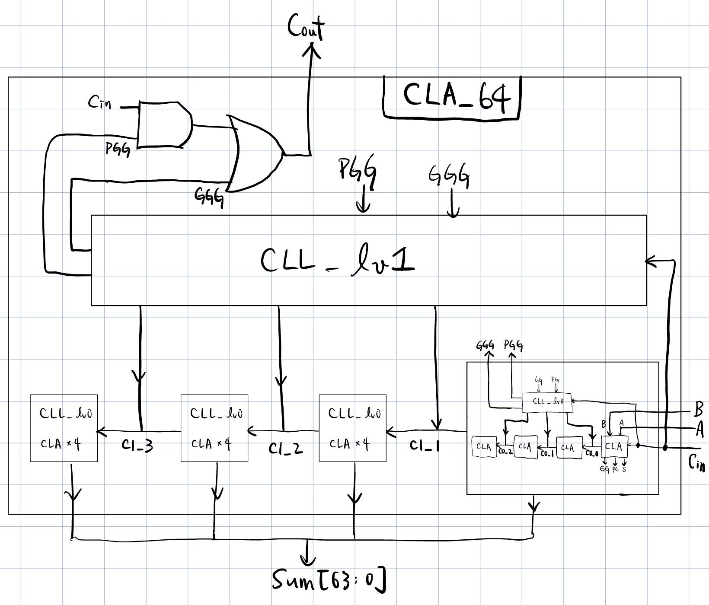
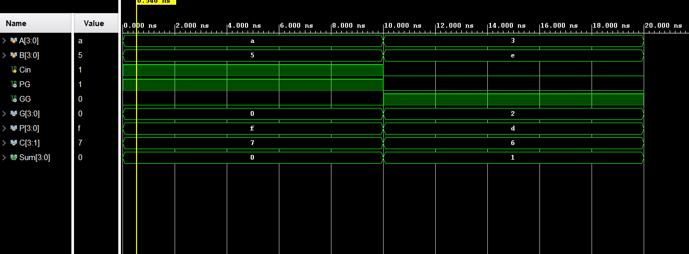
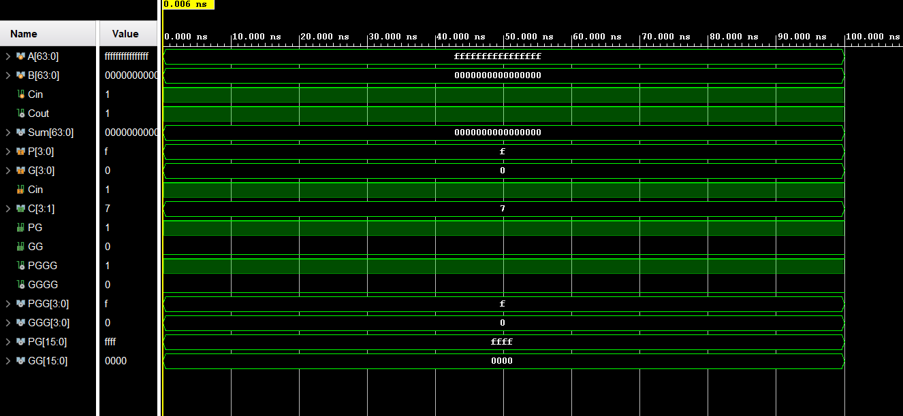
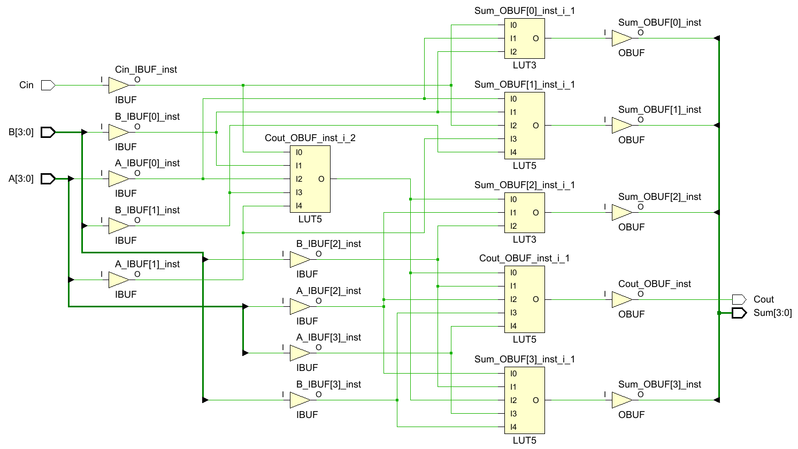
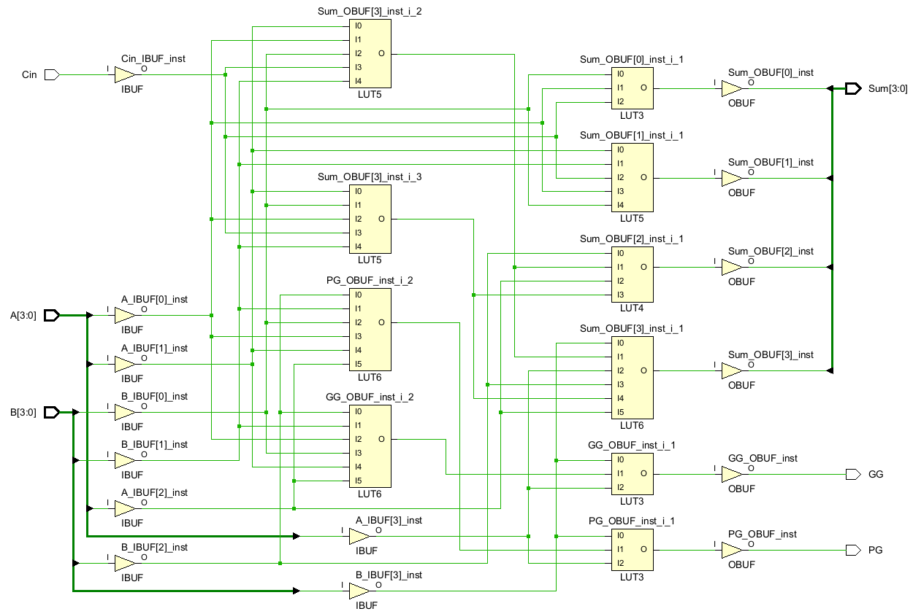

# Lab 03 — Adder

Lab 03 延續前兩個 Lab 的 combinational logic design，進一步進入 **Arithmetic Circuit**，從 Half Adder / Full Adder 開始，逐步建立 Ripple Carry Adder、Carry Lookahead Adder、Signed Addition / Subtraction 與 Overflow Detection。

本 Lab 也開始更明顯地接觸 **architecture、carry propagation、hierarchical design 與 synthesis mapping**，觀察相同 arithmetic function 在不同架構與 FPGA implementation 下的差異。

> **HA / FA → RCA → CLA → Signed Overflow → Add/Sub → FPGA Synthesis → Saturating Arithmetic Unit**

---

## Topics

| Category | Topics |
|---|---|
| Arithmetic | Half Adder、Full Adder、Ripple Carry Adder、Carry Lookahead Adder |
| Carry Logic | Carry Propagation、Propagate / Generate、Group Propagate / Generate |
| Signed Arithmetic | Two's Complement、Signed Addition、Subtraction、Overflow Detection |
| Design | Hierarchical Design、Shared Datapath、Carry Lookahead Hierarchy |
| Verification | Self-Checking Testbench、Waveform Verification |
| FPGA | Synthesis、LUT、Carry Chain、CARRY4、Technology Mapping |

---

## Adder Architecture

本 Lab 從最基本的 1-bit adder 開始，逐步建立較大位元數的 arithmetic circuit。

```text
Half Adder
    │
    ▼
Full Adder
    │
    ▼
Ripple Carry Adder
    │
    ▼
Carry Lookahead Adder
```

不同 architecture 的主要差異在於 **carry 如何產生與傳遞**。

RCA 讓 carry 逐級傳遞；CLA 則利用 Propagate / Generate 預先展開 carry relation，降低 carry dependency。

---

## Half Adder & Full Adder

### Half Adder

Half Adder 接收兩個 1-bit operands：

```text
A
B
```

輸出：

```text
Sum
Carry
```

Boolean function：

```text
Sum   = A XOR B
Carry = A AND B
```

---

### Full Adder

Full Adder 額外加入 `Cin`：

```text
A
B
Cin
```

輸出：

```text
Sum
Cout
```

Full Adder 可由兩個 Half Adder 組成：

```text
A ─────┐
       ▼
      HA
       │
B ─────┘
       │
       ▼
      HA
       │
Cin ───┘
       │
       ▼
     Sum / Cout
```

---

## Practice 1 — Ripple Carry Adder

[查看 Practice 1 Source Code](./practice1)

Practice 1 使用 Half Adder 與 Full Adder 建立 4-bit 與 8-bit Ripple Carry Adder。

主要 modules：

```text
HA
FA
RCA_4
RCA_8
```

整體 hierarchy：

```text
HA
 │
 ▼
FA
 │
 ▼
RCA_4
 │
 ▼
RCA_8
```

RCA 中每一級的 carry 都依賴前一級結果，因此 critical path 會隨 bit-width 增加。

Testbench 使用 self-checking 方式驗證 8-bit addition。

---

## Carry Lookahead Adder

RCA 的主要限制來自 carry propagation。

Carry Lookahead Adder 利用每一個 bit 的 Propagate / Generate：

```text
P(i) = A(i) XOR B(i)
G(i) = A(i) AND B(i)
```

並由：

```text
C(i+1) = G(i) OR (P(i) AND C(i))
```

計算 carry。

Carry relation 可以進一步展開，使多個 carry 不必完全依賴前一級 ripple result。

---

## Practice 2 — Carry Lookahead Adder

[查看 Practice 2 Source Code](./practice2)

Practice 2 建立：

```text
PFA
CLL_4
CLA_4
CLA_64
```

### PFA

`PFA` 負責產生：

```text
P
G
Sum
```

其中：

```text
P = A XOR B
G = A AND B
Sum = P XOR Cin
```

---

### CLL_4

`CLL_4` 根據四組 `P / G` 與 `Cin`，同時計算：

```text
C1
C2
C3
PG
GG
```

Group Propagate：

```text
PG = P3 P2 P1 P0
```

Group Generate：

```text
GG = G3
   + P3 G2
   + P3 P2 G1
   + P3 P2 P1 G0
```

因此 block carry-out 可表示為：

```text
Cout = GG OR (PG AND Cin)
```

---

### CLA_4

`CLA_4` 由四個 PFA 與一個 CLL_4 組成：

```text
4 × PFA
   │
   ▼
 CLL_4
   │
   ▼
Sum / PG / GG
```

---

### CLA_64

64-bit CLA 使用 hierarchical structure，將較小 block 的 `PG / GG` 再送入更高層的 Carry Lookahead Logic。

```text
16 × CLA_4
      │
      ▼
4 × CLL_4
      │
      ▼
1 × CLL_4
      │
      ▼
   Cout
```

架構圖：

<a href="./images/cla64_architecture.jpg">

</a>

此架構避免直接建立超大 fan-in 的 flat CLA，並利用 block-level `PG / GG` 完成更大位元數的 carry hierarchy。

---

## CLA Waveform Verification

Practice 2 另外觀察 CLA 內部的 carry、Propagate / Generate 與 hierarchy behavior。

### CLA_4

<a href="./images/q3_1_waveform.png">

</a>

Waveform 中加入：

```text
P
G
C
PG
GG
Sum
```

用來驗證 internal carry 與 group signal。

---

### CLA_64

<a href="./images/q3_2_waveform.png">

</a>

此 waveform 使用 carry propagation case，觀察 carry 如何經過不同 CLA hierarchy level 傳遞至最終 `Cout`。

---

## Signed Addition & Overflow

Unsigned carry-out 與 signed overflow 是不同的概念。

對 8-bit two's complement：

```text
Range = -128 ~ +127
```

Signed addition 發生 overflow 的典型情況：

```text
Positive + Positive → Negative
Negative + Negative → Positive
```

因此 overflow 可由 operands 與 result 的 sign bit 判斷。

---

## Practice 3 — Signed Addition & Overflow

[查看 Practice 3 Source Code](./practice3)

Practice 3 建立：

```text
Adder_8_OV
```

在 8-bit adder 上加入 signed overflow detection。

主要驗證：

- Normal Positive / Negative Addition
- Positive Overflow
- Negative Overflow

Testbench 使用 self-checking 方式確認 `Sum` 與 `OV`。

---

## Subtraction with Two's Complement

Subtraction 可利用 two's complement：

```text
A - B = A + (~B) + 1
```

因此 Addition 與 Subtraction 可以共用同一組 adder datapath。

利用 control signal `OP`：

```text
B_adj = B XOR {8{OP}}

OP = 0 → B_adj = B
OP = 1 → B_adj = ~B
```

再配合：

```text
Cin = OP
```

即可得到：

```text
OP = 0 → A + B
OP = 1 → A + ~B + 1 = A - B
```

---

## Practice 4 — Add / Sub ALU

[查看 Practice 4 Source Code](./practice4)

Practice 4 建立簡化的 8-bit arithmetic ALU：

```text
A
B
OP
 │
 ▼
B Adjustment
 │
 ▼
RCA_8
 │
 ▼
Sum / Overflow
```

`OP` 功能：

```text
OP = 0 → Addition
OP = 1 → Subtraction
```

Overflow detection 必須根據實際送入 adder 的 `B_adj` 判斷，而不是原始 `B`。

---

## FPGA Carry Chain & Synthesis

FPGA 中 arithmetic circuit 不一定直接依照手寫 RCA / CLA hierarchy 實作。

Xilinx FPGA 提供專用 carry resource，例如：

```text
CARRY4
```

用來加速常見的 arithmetic carry propagation。

實際 RTL 經過 synthesis 後，工具會根據 target FPGA architecture 進行 optimization 與 technology mapping。

---

### RCA_4 Synthesis

<a href="./images/rca_4_schematic.png">

</a>

本次手動建立的 RCA_4 synthesis 後主要映射為 LUT combinational network，沒有直接看到 `CARRY4` primitive。

---

### CLA_4 Synthesis

<a href="./images/cla_4_chematic.png">

</a>

CLA_4 同樣主要被映射為 LUT network。

這顯示：

> RTL architecture 與 FPGA physical implementation 並不是同一個 abstraction level。

手動建立 RCA / CLA 有助於理解 arithmetic architecture，但在一般 application RTL 中，如果需求只是「進行加法」，通常可以直接描述：

```verilog
assign result = A + B;
```

再由 synthesis tool 決定適合 target device 的 implementation。

---

## Additional Project — 8-bit Saturating Arithmetic Unit

[查看 8-bit Saturating Arithmetic Unit](./project)

此 Additional Project 延伸 Practice 4 的 Add / Sub datapath，加入 signed saturation control 與 status flags。

主要功能：

```text
Signed Addition
Signed Subtraction
Signed Overflow Detection
Wrap-around Mode
Saturation Mode
```

整體架構：

```text
A, B, OP
    │
    ▼
Arithmetic_Unit_8
    │
    ├── raw_result
    └── overflow
          │
          ▼
Saturation_Control_8
          │
          ▼
        result
          │
          ▼
   zero / negative
```

`sat_enable` 控制 overflow 發生時的處理方式：

```text
sat_enable = 0 → Wrap-around
sat_enable = 1 → Saturation
```

Saturation boundary：

```text
Positive Overflow → +127
Negative Overflow → -128
```

另外輸出：

```text
overflow
saturated
zero
negative
```

Testbench 使用 self-checking verification，涵蓋 normal Add / Sub、positive / negative overflow、wrap-around 與 saturation behavior。

所有設定的 test cases 皆通過。

---

## Repository Structure

```text
lab03/
│
├── README.md
│
├── images/
│   ├── cla64_architecture.jpg
│   ├── q3_1_waveform.png
│   ├── q3_2_waveform.png
│   ├── rca_4_schematic.png
│   └── cla_4_chematic.png
│
├── practice1/
│   ├── HA.v
│   ├── FA.v
│   ├── RCA_4.v
│   ├── RCA_8.v
│   └── tb_RCA_8.v
│
├── practice2/
│   ├── PFA.v
│   ├── CLL_4.v
│   ├── CLA_4.v
│   ├── CLA_64.v
│   ├── tb_CLA_4.v
│   ├── tb_CLA_64.v
│   └── tb_CLA_64_q3_2.v
│
├── practice3/
│   ├── FA.v
│   ├── RCA_8.v
│   ├── Adder_8_OV.v
│   ├── tb_FA.v
│   ├── tb_RCA_8.v
│   └── tb_Adder_8_OV.v
│
├── practice4/
│   ├── FA.v
│   ├── RCA_8.v
│   ├── ALU_8.v
│   └── tb_ALU_8.v
│
└── project/
    ├── README.md
    ├── Arithmetic_Unit_8.v
    ├── Saturation_Control_8.v
    ├── Saturating_ALU_8.v
    └── tb_Saturating_ALU_8.v
```
